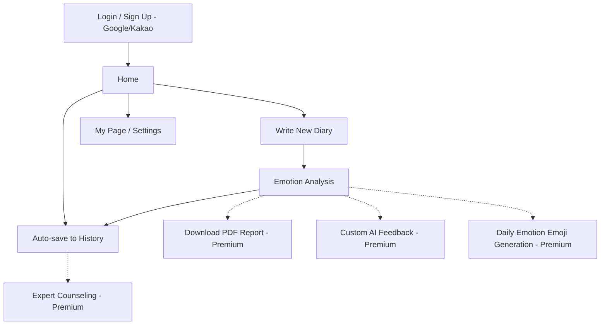

# ✍️💭 MindNote - AI 기반 감성 일기 & 심리 분석 서비스

## 📋 프로젝트 소개
> **MindNote**(가칭)는 OpenAI 기반 LLM을 활용해 사용자의 일기를 분석하고, 감정 및 심리 상태를 피드백해 주는 웹/앱 기반 서비스입니다.
> 외로움, 자기 성찰, 정신 건강에 관심이 많은 사용자들을 위한 맞춤형 감성 분석 및 리포트 서비스를 제공합니다.

---

## 🛠️ 기술 스택 <각 팀원분들께서 해당 내용 수정 부탁드립니다>

| 분류        | 기술                                           |
|------------|-----------------------------------------------|
| Front-End  | React, Next.js (예정)                          |
| Back-End   | Spring Boot                                   |
| AI / Data  | Python 3.1x, OpenAI GPT-4o                     |
| Database   | PostgreSQL / MongoDB (선택 예정)               |
| Auth       | OAuth2 (Google, Kakao), JWT                   |
| Deploy     | Vercel / Netlify (Frontend), AWS EC2 / RDS (Backend) |
| Tools      | Git, GitHub, Discord, Notion                  |

---

## 🌟 주요 기능

### ✏️ 일기 작성
- 날짜별 일기 작성 및 저장
- 키워드 자동 추출
- 작성 유도 프롬프트 제공

### 📊 감정 분석
- 감정 상태 추론
- 감정 강도 비율 출력
- 오늘의 감정 키워드 및 요약 피드백

### 📈 히스토리 & 리포트
- 감정 변화 추이 그래프 제공 (주/월별)
- 과거 일기 리포트 요약 및 분석
- 감정 리포트 PDF 다운로드 (Premium)

### 🌟 프리미엄 전용 기능
- 감정 분석 리포트 PDF 다운로드
- AI 피드백 조정 (행동, 음식, 음악 추천 등)
- 전문가 상담 연계 (추후)

---

## 🗺️ 서비스 플로우




## 🔒 보안 및 개인정보 보호
- 사용자 데이터 전체 암호화 저장
- OAuth2 인증을 통한 안전한 로그인 제공
- 개인정보 보호 정책 명시

---

## 📄 향후 확장 계획
- 감정 기반 추천 콘텐츠 (영상, 도서 등) 제공
- 사용자별 심리 패턴 분석 기능 개발
- 글로벌 다국어 버전 출시
- 전문가 상담 연계 (외부 심리상담센터, 정신건강의학과와의 협력 기능)

---

## 🔗 관련 문서 <각 팀원분들께서 해당 내용 수정 부탁드립니다>
- [기획안 보기](#)
- [UI/UX 설계안 보기](#)
- [서비스 플로우도 보기](#)

---

# 📌 “MindNote를 통해 ‘나’를 더 잘 이해하는 하루를 시작하세요.”

---

# 📦 GitHub Repository 기본 구조 <각 팀원분들께서 해당 내용 수정 부탁드립니다>

```bash
MindNote/
├── backend/                # Spring Boot API Server
├── frontend/               # React or Next.js Frontend
├── docs/
│   ├── assets/             # Flowchart PNG, SVG, UI Wireframes
│   └── design/             # Style Guide, Components
├── data/                   # 샘플 데이터, 테스트 일기 샘플
├── scripts/                # 배포, 빌드 스크립트 모음
├── README.md               # 이 파일
└── LICENSE
```
